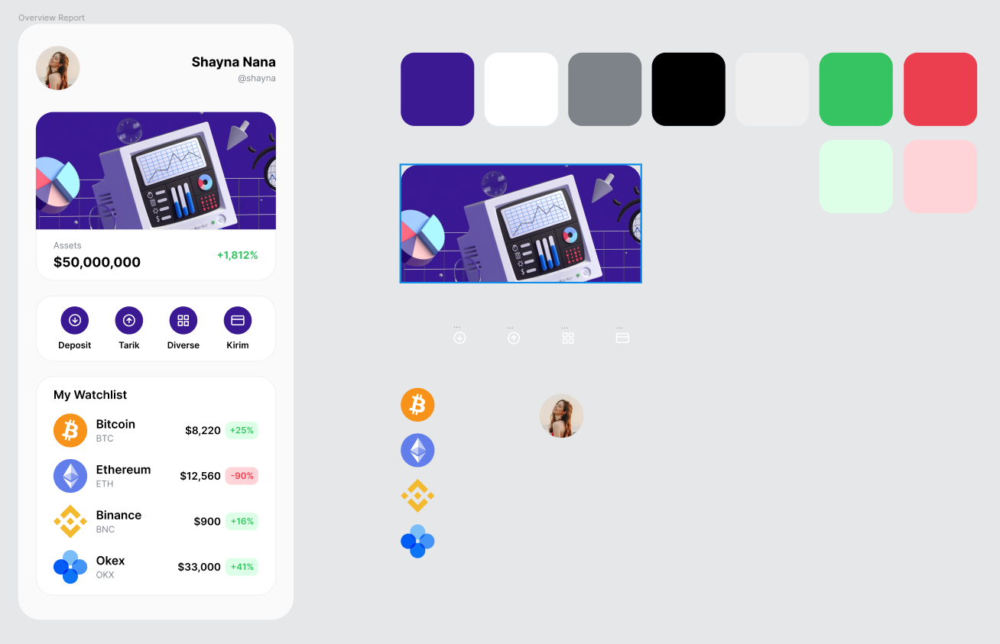

# crypty

Chegou a hora de componentizar tudo!

## Componentização
Composição ou componentização é o termo utilizado quando precisamos criar classes reutilizáveis nos nossos projetos com Flutter.

A proposta é simples: reutilização. Ninguém gosta de ficar escrevendo código ou copiar e colar a mesma coisa várias vezes. Por isso a criação de componentes reutilizáveis é tão importante.

## Por onde começar?
Pelo começo, sempre. O planejamento é um dos principais passos a se pensar quando estamos envolvidos em um projeto de desenvolvimento.

O ponto em que precisamos pensar antes de agir. Pré visualizar antes de implementar. E na maioria das vezes teremos disponível um protótipo ou uma referência visual que precisaremos transformar em código.

## Desafio
A partir do código principal do nosso projeto, você terá o desafio de componentizar praticamente tudo!

## Dicas
- Se repetiu o mesmo código pelo menos 3 vezes, reutilize.
- Comece pelas cores e estilos de texto
- Separe suas classes por responsabilidade
- Mantenha o código simples, tenha controle sobre o que você está modificando
- Divirta-se!

[Créditos do Projeto Figma](https://www.figma.com/community/file/1156756149832804269)

