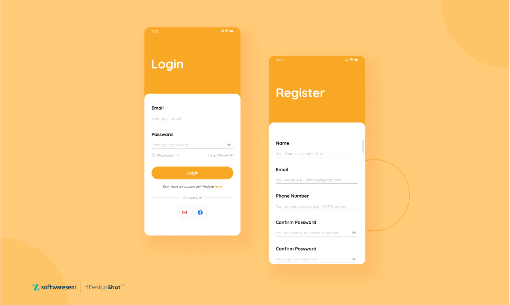

## Formy

Olá, dev! Você ficou responsável pela tarefa de construir a página de login e registro do app Formy.

O time de design trabalhou duro e nos entregou uma visão do que se espera para essas telas. O resultado esperado deve estar de acordo com o seguinte modelo:

## Desafio
Utilizando todos os seus conhecimentos sobre construção de telas, formulários e componentização, realize a entrega dessas telas. Aceita o desafio?

## Dicas
Utilize os comentários `TODO` para se orientar sobre o que é necessário fazer. Você encontrará algumas indicações:
- `[TASK]` - orienta a tarefa a ser realizada
- `[INFO]` - orienta sobre alguma informação que servirá como auxiliar para você concluir suas tarefas
- `[DOC]` - indica o link para a documentação oficial sobre algum assunto específico
- `[FIGMA]` - indica o link para o componente no figma

[Créditos do Figma](https://www.figma.com/community/file/1153510982026285337)